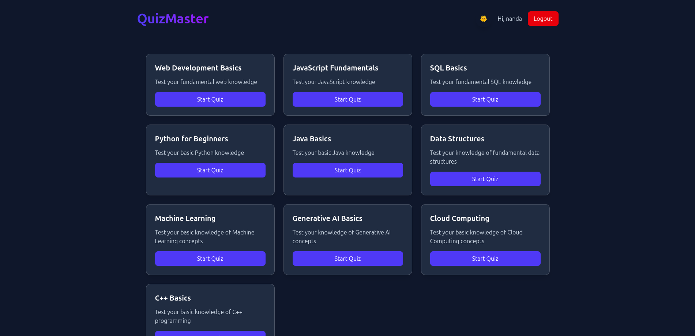
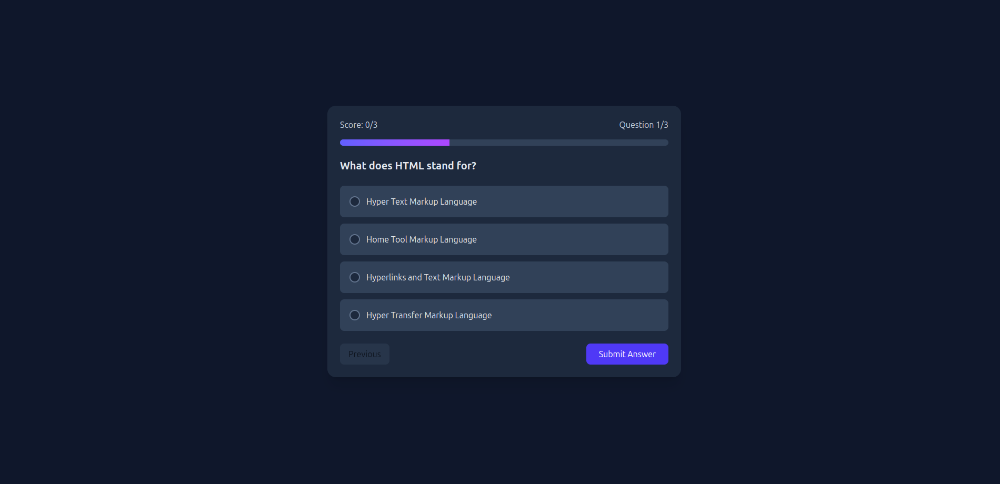
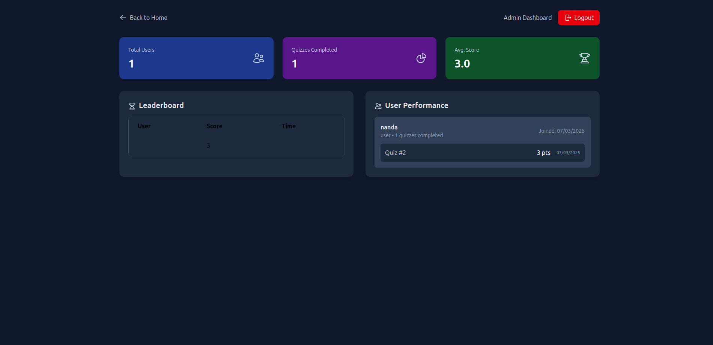

# Quiz-Master
A Frontend project that allows users to attempt quizzes of various computer languages. It is built completely using Reactjs and TailwindCSS.

## Usage:-
## Normal User
1. Sign Up (Optional - can use guest account)

2. Select quiz from home page

3. Answer questions with instant feedback

4. View final score and review answers

## Admin login
1. Login Credentials or direct(login as admin button):

    Username: admin
    Password: admin123

2. Access admin dashboard from navigation

3. View:
   
  - All user scores
  - Leaderboard
  - Quiz statistics
  - User engagement metrics

## 📸 Screenshots

